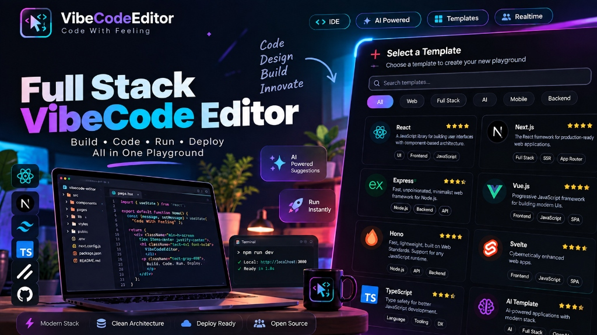

<div align="center">

# ⚡ VibeCode Editor
### *Next-Generation Cloud IDE & AI-Powered Full-Stack Coding Playground*

[](https://vibe-code-editor-vert.vercel.app/)
[](https://nextjs.org/)
[](https://www.typescriptlang.org/)
[](https://tailwindcss.com/)
[](https://www.prisma.io/)
[](https://www.mongodb.com/)
[](https://ai.google.dev/)

<br/>



</div>

---

## 🌟 Overview

**VibeCode Editor** is a state-of-the-art, in-browser Full-Stack Cloud IDE built with **Next.js 15 (App Router)**, **WebContainers**, **Monaco Editor**, and **Google Gemini AI**. It enables developers to scaffold, edit, run, debug, and preview modern full-stack web applications entirely inside the browser without setting up any local environment.

> 🚀 **Live URL**: [https://vibe-code-editor-vert.vercel.app](https://vibe-code-editor-vert.vercel.app/)

---

## ✨ Key Features

### 🖥️ 1. In-Browser Node.js Runtime (WebContainers)
- Execute real Node.js processes, run dev servers (`npm run dev`), build tools, and scripts right inside your browser.
- Instant hot-reloading with multi-port live preview iframe.
- Cross-origin isolated architecture with sub-second boot times.

### 🤖 2. Gemini-Powered AI Copilot
- **Real-time Code Suggestions**: Smart inline autocompletions (`Ctrl + Space` or double `Enter`).
- **Interactive AI Chat Sidepanel**: Ask questions, explain code, generate features, and fix errors directly from your editor workspace.
- Multi-model intelligence powered by Google Gemini AI & Astra AI.

### 🧱 3. Ready-to-Code Full-Stack Templates
Instant 1-click scaffolding for modern frameworks:
- ⚛️ **React** (Vite + TypeScript / Tailwind)
- 🔺 **Next.js** (App Router)
- 🚂 **Express.js** (Node.js REST API)
- ⚡ **Hono** (Ultra-fast Edge API)
- 🟢 **Vue.js** (Vite + Composition API)
- 🅰️ **Angular** (TypeScript)

### 💻 4. Pro-Grade Editor & Terminal
- **Monaco Editor Engine** with VS Code-grade syntax highlighting, code folding, bracket matching, and intelligent IntelliSense.
- **Embedded xterm.js Terminal** with WebGL acceleration, search, fit addons, and interactive shell execution.
- **Full File Tree Management**: Create, rename, edit, download, and delete nested files and folders.

### 🔐 5. Secure Authentication & Cloud Persistence
- **NextAuth.js v5 (Auth.js)** with Google and GitHub OAuth 2.0.
- **MongoDB Atlas & Prisma ORM** for persistent playground projects, starred items, and chat history.

---

## 🛠️ Tech Stack

| Domain | Technologies Used |
|---|---|
| **Frontend Framework** | [Next.js 15](https://nextjs.org/) (App Router), React 19, TypeScript |
| **Styling & Design** | [Tailwind CSS v4](https://tailwindcss.com/), Radix UI Primitives, Lucide Icons |
| **Editor & Shell** | [Monaco Editor](https://microsoft.github.io/monaco-editor/), [xterm.js](https://xtermjs.org/) |
| **Browser Runtime** | [@webcontainer/api](https://webcontainers.io/) |
| **Database & ORM** | [MongoDB Atlas](https://www.mongodb.com/atlas), [Prisma Client v6](https://www.prisma.io/) |
| **Authentication** | [NextAuth.js v5](https://authjs.dev/) (OAuth via Google & GitHub) |
| **AI Engine** | [Google Gemini 2.5 Flash SDK](https://ai.google.dev/), Astra & Experiential API |
| **Deployment** | [Vercel](https://vercel.com/) with Serverless Functions |

---

## 🚀 Quick Start (Local Development)

### 1. Clone the Repository
```bash
git clone https://github.com/buddherohit/VibeCodeEditor.git
cd VibeCodeEditor/vibecode-editor
```

### 2. Install Dependencies
```bash
npm install
```

### 3. Setup Environment Variables
Create `.env.local` inside the `vibecode-editor` folder:
```env
DATABASE_URL=mongodb+srv://<username>:<password>@cluster0.xxxxx.mongodb.net/vibecode?retryWrites=true&w=majority
AUTH_SECRET=your_32_character_random_secret_here
AUTH_TRUST_HOST=true
NEXTAUTH_URL=http://localhost:3000

# OAuth Credentials
AUTH_GITHUB_ID=your_github_client_id
AUTH_GITHUB_SECRET=your_github_client_secret
AUTH_GOOGLE_ID=your_google_client_id
AUTH_GOOGLE_SECRET=your_google_client_secret

# AI API Keys
GEMINI_API_KEY=your_gemini_api_key
EXPERIENTIAL_API_KEY=your_astra_or_experiential_key
ASTRA_API_KEY=your_astra_key
```

### 4. Generate Prisma Client & Run Dev Server
```bash
npx prisma generate
npm run dev
```

Open [http://localhost:3000](http://localhost:3000) in your browser.

---

## 🌐 Production Deployment (Vercel)

1. **Push your code to GitHub**:
   ```bash
   git add .
   git commit -m "feat: deploy ready"
   git push origin main
   ```
2. **Import Project on Vercel**:
   - Set **Root Directory** to `vibecode-editor`.
   - Add all environment variables from `.env.local` (set `NEXTAUTH_URL` to your production domain `https://your-app.vercel.app`).
3. **MongoDB Whitelist**:
   - In MongoDB Atlas -> **Network Access**, ensure `0.0.0.0/0` (Allow Anywhere) is active.
4. **Update OAuth Callback URLs**:
   - **GitHub**: `https://your-app.vercel.app/api/auth/callback/github`
   - **Google**: `https://your-app.vercel.app/api/auth/callback/google`

---

## ⌨️ Useful Keyboard Shortcuts

| Shortcut | Action |
|---|---|
| `Ctrl + Space` / `Double Enter` | Trigger AI Autocomplete |
| `Tab` | Accept AI Code Suggestion |
| `Ctrl + S` / `Cmd + S` | Save File & Auto-Format |
| `Ctrl + B` / `Cmd + B` | Toggle File Explorer |
| `Ctrl + \`` | Toggle Integrated Terminal |

---

## 📁 Project Structure

```
vibecode-editor/
├── app/                        # Next.js App Router Pages & API Routes
│   ├── (auth)/auth/            # Sign-in & Authentication Pages
│   ├── (root)/                 # Landing Page & Marketing Showcase
│   ├── api/                    # Serverless APIs (Chat, Suggestions, Auth, Templates)
│   ├── dashboard/              # User Dashboard & Project Manager
│   └── playground/[id]/        # Full-Featured IDE & WebContainer Workspace
├── components/                 # Reusable UI Components (Radix UI / Tailwind)
├── features/                   # Feature-based Modules (AI Chat, WebContainers, Auth)
│   ├── ai-chat/                # AI Sidepanel & Prompt Engineering
│   ├── auth/                   # Auth Forms & Buttons
│   ├── dashboard/              # Projects Table, Metrics & Template Cards
│   ├── playground/             # Monaco Editor, Tabs, Settings & Actions
│   └── webcontainers/          # WebContainer Instance Manager & Terminal Hooks
├── lib/                        # Prisma Client & Utility Helpers
├── prisma/                     # Database Schema & Migrations (MongoDB)
├── public/                     # Icons, Favicons, Brand Logos & Thumbnails
└── vibecode-starters/          # Framework Starter Templates (React, Next, Express, Vue)
```

---

## 🤝 Contributing

Contributions, issues, and feature requests are welcome!
Feel free to check the [issues page](https://github.com/buddherohit/VibeCodeEditor/issues).

```bash
# Fork the repo -> Create your branch -> Commit changes -> Open Pull Request
git checkout -b feat/amazing-feature
git commit -m "feat: add amazing feature"
git push origin feat/amazing-feature
```

---

## 📄 License

Distributed under the **MIT License**. See `LICENSE` for more information.

<div align="center">

Made with ❤️ by [Rohit Buddhe](https://github.com/buddherohit)

</div>
